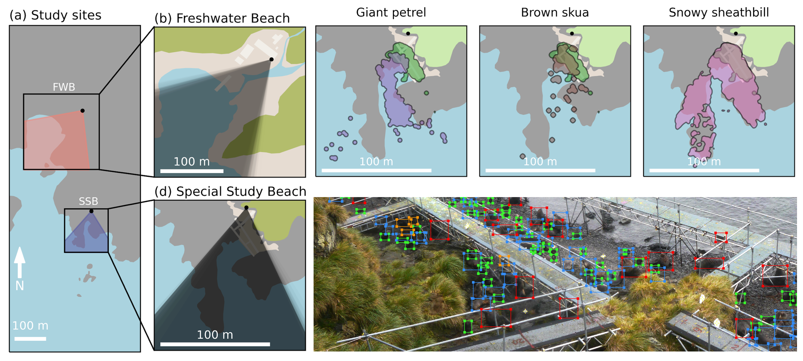

# Colony matters: How density shapes predator access in two Antarctic fur seal (*Arctocephalus gazella*) colonies

**Authors:** Johannes Bartl [](https://orcid.org/0009-0003-3647-2472),
Ane Liv Berthelsen [](https://orcid.org/0000-0001-6718-6709),
Alexander Winterl [](https://orcid.org/0000-0003-0688-9317),
Cameron Fox-Clarke,
Jaume Forcada [](https://orcid.org/0000-0002-2115-0150),
Rebecca Nagel [](https://orcid.org/0000-0002-2925-1028),
Joseph I. Hoffman [](https://orcid.org/0000-0001-5895-8949),
Ben Fabry [](https://orcid.org/0000-0003-1737-0465)

[](https://doi.org/10.5281/zenodo.18955385)
[](https://opensource.org/licenses/MIT)

<p align="center">
  
</p>

## Installation

### Prerequisites
* Python: 3.8.10
* python packages listed in requirements.txt
For training a GPU is recommended - we used:
* Hardware: NVIDIA GeForce RTX 3070 (8GB VRAM)
* CUDA Toolkit: 11.2 (Required for reproducibility)
* NVIDIA Driver: 575.51 (Supports CUDA 11.2+)

### Setup
1.  Clone the repository:
    ```bash
    git clone https://github.com/fabrylab/AntarcticFurSealDensity.git
    cd AntarcticFurSealDensity
    ```
2.  Install dependencies:
    ```bash
    pip install -r requirements.txt
    ```


This repository contains the code, models, and analysis scripts associated with the paper **"Colony matters: How density shapes predator access in two Antarctic fur seal (*Arctocephalus gazella*) colonies"**.

## Repository Structure

### Code & Notebooks
* **`training.ipynb`**: Pipeline to train the YOLOv8 neural network.
* **`analysis.ipynb`**: Main analysis script for generating statistical results and figures.

### Models
* **`model.pt`**: Trained YOLOv8-large weights file used to predict the full dataset.

### Data & Detections
* **`FWB.csv`**: Neural network detection results for Freshwater Beach.
* **`SSB.csv`**: Neural network detection results for Special Study Beach.

### Map Data
* **`FWB.kml` / `FWB.png` / `FWB_v1.cdb`**: Georeferencing and annotation data for Freshwater Beach.
* **`SSB.kml` / `SSB.png` / `SSB_v1.cdb`**: Georeferencing and annotation data for Special Study Beach.
* **`both_areas.kml` / `both_areas.png` / `both_areas_v1.cdb`**: Combined map data.

## Dataset Access (Zenodo)

The raw imagery and primary annotation databases are hosted on Zenodo.

**Dataset DOI:** [10.5281/zenodo.18955385](https://doi.org/10.5281/zenodo.18955385)

The Zenodo dataset includes:
1.  **Raw Imagery:** 110 high-resolution `.jpg` images.
2.  **Annotations:** Corresponding `.cdb` (ClickPoints) databases containing ground-truth annotations.

## Analysis & Figures

The `analysis.ipynb` notebook reproduces the following key results:

* **(a) Temporal trends in abundance at Special Study Beach** (Figure 2)
* **(b) Abundance ratios of birds to pups between colonies** (Figure 3)
* **(c) Demographic patterns in seal density** (Figure 4)
* **(d) Spatial associations between birds and pups** (Figure 5)
